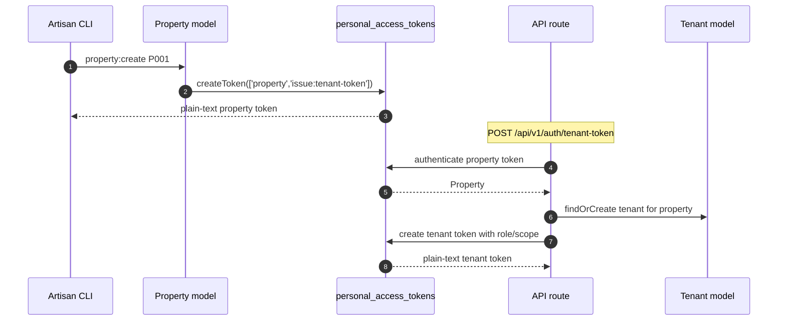

# property-tenant-auth

[](https://github.com/natha-i96/property-tenant-auth)
[](https://packagist.org/packages/natha-i96/property-tenant-auth)

A reusable Laravel package that provides two-level Sanctum API authentication for **Property** and **Tenant** tokens. It is **Frankenphp-safe** because it uses Sanctum's default guard and standard `Authenticatable` models — no custom guard is required.

- **Property token**: long-lived token used by a property management system. Can issue scoped tenant tokens.
- **Tenant token**: short-lived token issued by a property token. Carries role and tenant scope.

---

## Features

- Two-level Sanctum token hierarchy (Property → Tenant).
- No custom Laravel guard; works with Frankenphp and Octane.
- Polymorphic `personal_access_tokens` via a merged morph map so host-extended models stay resolvable.
- Configurable model classes, route prefix, middleware, abilities, and throttle limits.
- Built-in artisan command to bootstrap properties and print their plain-text tokens.
- Property-scoped route binding for tenant resource actions.
- Independent test suite via Orchestra Testbench.

---

## Installation

### 1. Require the package

```bash
composer require natha-i96/property-tenant-auth
```

### 2. Publish the config

```bash
php artisan vendor:publish --tag=property-tenant-auth-config
```

### 3. Publish and run migrations

The package ships migrations for `properties`, `tenants`, and a polymorphic Sanctum `personal_access_tokens` table.

```bash
php artisan vendor:publish --tag=property-tenant-auth-migrations
php artisan migrate
```

### 4. Ensure Sanctum is configured

Make sure `config/sanctum.php` is API-only:

```php
'guard' => [],
'stateful' => [],
```

and define an `api` rate limiter in `AppServiceProvider::boot()`:

```php
use Illuminate\Cache\RateLimiting\Limit;
use Illuminate\Http\Request;
use Illuminate\Support\Facades\RateLimiter;

RateLimiter::for('api', function (Request $request): Limit {
    return Limit::perMinute(60)->by($request->user()?->id ?: $request->ip());
});
```

### 5. Register the route middleware (optional)

The package registers aliases automatically (`abilities`, `ability`, `tokenable.active`). Enable API throttling in `bootstrap/app.php` if you want per-route throttles to work:

```php
$middleware->throttleApi();
```

---

## Host model extension

The package provides base models under `NathaI96\PropertyTenantAuth\Models\Property` and `Tenant`. In your host application, extend them so factories and project-specific behavior remain local:

```php
<?php

namespace App\Models;

use Illuminate\Database\Eloquent\Factories\Factory;
use NathaI96\PropertyTenantAuth\Models\Property as BaseProperty;

class Property extends BaseProperty
{
    protected static function newFactory(): Factory
    {
        return \Database\Factories\PropertyFactory::new();
    }
}
```

```php
<?php

namespace App\Models;

use Illuminate\Database\Eloquent\Factories\Factory;
use NathaI96\PropertyTenantAuth\Models\Tenant as BaseTenant;

class Tenant extends BaseTenant
{
    protected static function newFactory(): Factory
    {
        return \Database\Factories\TenantFactory::new();
    }
}
```

Then point the config to your host models:

```php
// config/property-tenant-auth.php
'models' => [
    'property' => App\Models\Property::class,
    'tenant' => App\Models\Tenant::class,
],
```

---

## Configuration

The published config (`config/property-tenant-auth.php`) supports:

| Key | Default | Purpose |
| --- | --- | --- |
| `models.property` | `NathaI96\PropertyTenantAuth\Models\Property` | Property model class |
| `models.tenant` | `NathaI96\PropertyTenantAuth\Models\Tenant` | Tenant model class |
| `routes.enabled` | `true` | Whether the package registers its routes |
| `routes.prefix` | `api` | URL prefix for package routes |
| `routes.middleware` | `['api']` | Middleware applied to the route group |
| `tokens.property` | `['property', 'issue:tenant-token']` | Abilities on a property token |
| `tokens.tenant` | `['tenant']` | Base ability on a tenant token |
| `pagination.per_page` | `25` | Tenants index pagination |
| `throttle.tenant_token` | `5,1` | Throttle for tenant-token issuance |
| `throttle.revoke` | `5,1` | Throttle for token revocation |
| `throttle.general` | `api` | Throttle for all other package routes |

All values can also be driven by environment variables:

```dotenv
PTA_PROPERTY_MODEL=App\Models\Property
PTA_TENANT_MODEL=App\Models\Tenant
PTA_ROUTES_ENABLED=true
PTA_ROUTES_PREFIX=api
PTA_TENANT_TOKEN_THROTTLE=5,1
PTA_REVOKE_THROTTLE=5,1
PTA_GENERAL_THROTTLE=api
```

---

## Routes

Once installed, the following endpoints are available under the configured prefix (default `/api`):

| Method | Endpoint | Token | Middleware / ability |
| --- | --- | --- | --- |
| `GET` | `/v1/me` | any | `auth:sanctum`, `tokenable.active`, `ability:property,tenant` |
| `POST` | `/v1/auth/tenant-token` | property | `auth:sanctum`, `tokenable.active`, `abilities:property,issue:tenant-token` |
| `POST` | `/v1/auth/revoke` | any | `auth:sanctum`, `tokenable.active` |
| `GET` | `/v1/tenants` | property | `auth:sanctum`, `tokenable.active`, `abilities:property` |
| `DELETE` | `/v1/tenants/{tenant}/tokens` | property | `auth:sanctum`, `tokenable.active`, `abilities:property` |

---

## Bootstrap a property

Run the included command to create a property and display its plain-text token once:

```bash
php artisan property:create P001 --name="Acme Property"
```

Re-running the same `property_no` will fail with a validation error.

---

## Issuing a tenant token

Use a property token to issue a scoped tenant token:

```http
POST /api/v1/auth/tenant-token
Authorization: Bearer <property-token>
Content-Type: application/json

{
    "property_no": "P001",
    "tenant_no": "T001",
    "role": "tenant",
    "abilities": ["read:inventory"],
    "expires_in": 60
}
```

Response:

```json
{
    "token": "<plain-text-tenant-token>",
    "tenant": { ... }
}
```

`expires_in` is in minutes. Negative values are rejected.

---

## How it works



The package registers a merged morph map so that `tokenable_type` stores short aliases (`property`, `tenant`) bound to whichever model classes the host configures.

---

## Testing

The package has its own PHPUnit suite powered by Orchestra Testbench:

```bash
vendor/bin/phpunit -c packages/property-tenant-auth/phpunit.xml
```

When consumed in a host Laravel app, you can also include the package tests in the host `phpunit.xml`:

```xml
<testsuite name="Package Unit">
    <directory suffix="Test.php">./packages/property-tenant-auth/tests/Unit</directory>
</testsuite>
<testsuite name="Package Feature">
    <directory suffix="Test.php">./packages/property-tenant-auth/tests/Feature</directory>
</testsuite>
```

---

## Requirements

- PHP `^8.2`
- Laravel `^11.0` or `^12.0`
- Laravel Sanctum `^4.0`

---

## License

MIT
